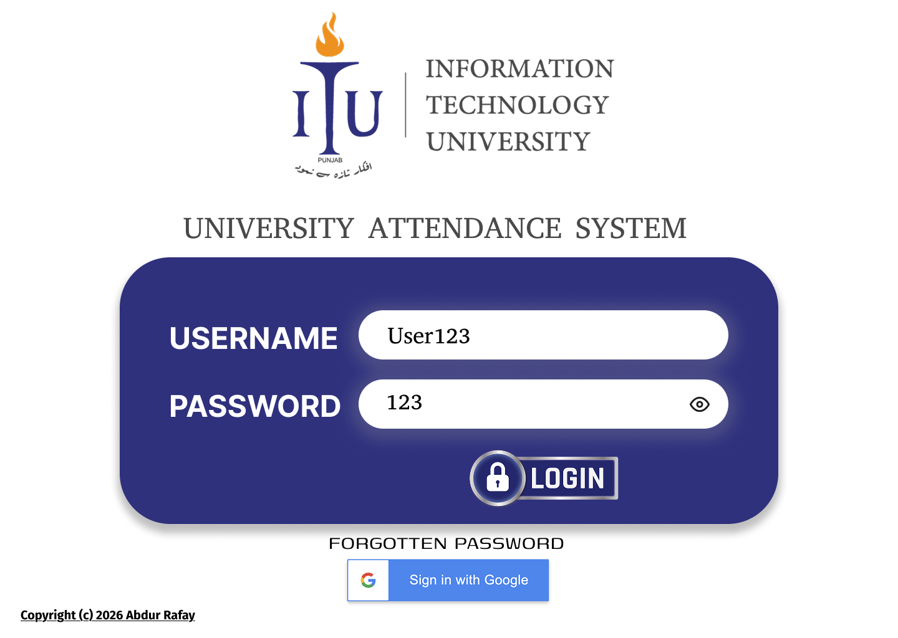
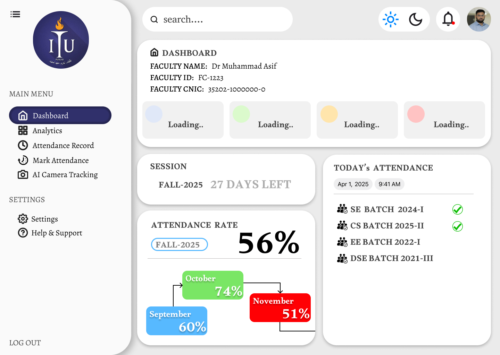

# 🎓 AI-Based University Attendance System — UI/UX Prototype

## 📌 Overview
This project presents a complete UI/UX prototype for an AI-Based Attendance System designed for universities.  
The system aims to automate attendance tracking using AI technologies such as facial recognition while providing an intuitive interface for students, faculty, and administrators.

This repository contains the design documentation and preview assets of the system.

---

## 🎯 Objectives
- Replace manual attendance methods  
- Reduce proxy attendance  
- Provide real-time attendance analytics  
- Improve transparency between students and administration  
- Deliver a seamless digital experience through modern UI/UX design  

---

## 🧠 Key Features (Proposed System)
- AI Facial Recognition Attendance  
- Student Dashboard  
- Teacher Attendance Control Panel  
- Real-Time Reports & Analytics  
- Course-wise Attendance Tracking  
- Notifications & Alerts  
- Secure Authentication System  

---

## 🎨 Design Approach
The design focuses on:

- Clean academic-friendly interface  
- Accessibility for all users  
- Minimal learning curve  
- Fast interaction flow  
- Mobile + Desktop responsiveness  

---

## 🔗 Live Prototype
View the interactive prototype here:

👉 https://www.figma.com/proto/lqAguBSWrXUO5gCmTatlBO/AI-BASED-ATTENDANCE-SYSTEM?node-id=1-2&p=f&t=KfJ2qVHFvUBA6MDd-1&scaling=min-zoom&content-scaling=fixed&page-id=0%3A1&starting-point-node-id=1%3A2

*(Note: This is a view-only link to protect intellectual property.)*

---

## 🖼️ Screens Preview

| Login Screen | Dashboard | AI Camera Tracking |
|-------------|-----------|--------------------|
|  |  |  |

---

## 🔐 Intellectual Property Notice
This design is protected under copyright law.  
Unauthorized reproduction, modification, or redistribution of this work is strictly prohibited.

This repository is published for:

✔ Academic presentation  
✔ Portfolio demonstration  
✔ Research reference  

---

## 📚 Use Case
Designed for universities seeking to implement AI-driven digital transformation in attendance management systems.

---

## 👨‍💻 Author
**Abdur Rafay**  
Software Engineering Student  

📧 bsse24002@itu.edu.pk  

---

## 📄 License
This project is licensed under a Custom Academic License.  
See the `LICENSE.txt` file for details.
